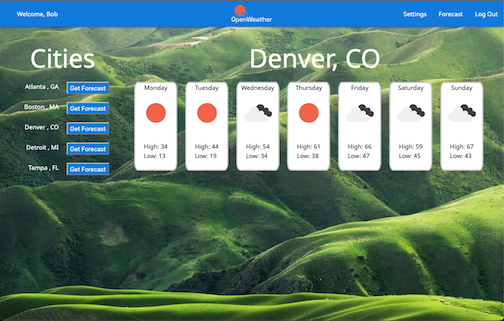

#  WeatherApp
WeatherApp is website geared towards giving each user the current 7-day forecast for each city they enter (given the zip code). The forecast is retrieved from http://openweathermap.org
## Screen Shots

After first loading, click on the "Sign Up" button to create a new user.  You will see this screen:


Enter your login information and click on "Sign Up".
Next, click on the "Settings" link in the Navigation Bar.


Enter a 5-digit zip code of cities you wish to get the forecast for. When finished, click on the "Forecast" link in the Navigation Bar. Click on the "Get Forecast" button to get the 7-day forecast for that city.



## Technologies
- HTML
- CSS
- Javascript
- React
- Express
- Mongoose/MongoDB
- Node
- OpenWeather
- Zipcodestack

## Installation
After cloning,

1. Run (on both weather-server and weather-client):

```
npm install
```


2. On just weather-server, create a .env file and populate with correct values:

```
DATABASE_URL=mongodb+srv://<username>:<password>@<cluster>.mongodb.net/weatherApp?retryWrites=true&w=majority
SECRET=<secret>  
ZIPCODESTACK_KEY=<key for https://zipcodestack.com/>
OPENWEATHERMAP_KEY=<key for https://openweathermap.org/>
```

## Exectuion
To begin execution, 

1. Start up the server first (i.e. weather-server)
```
nodemon server
```

2. Next, start up the client (i.e. weather-client):

```
npm run dev
```

3. In the browser:

```
http://localhost:5173
```
